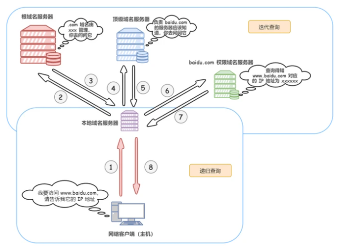

# 地址栏输入 URL 敲下回车后发生了什么?
1. URL解析
首先判断你输入的是一个合法的URL 还是一个待搜索的关键词，并且根据你输入的内容进行对应操作
URL的解析第过程中的第一步，一个url的结构解析如下：

2. DNS 查询
获取域名对应的目标服务器IP地址

3. TCP 连接
经历三次握手建立TCP连接

4. HTTP 请求
当建立tcp连接之后，就可以在这基础上进行通信，浏览器发送 http 请求到目标服务器  
请求的内容：
    1. 请求行  
    2. 请求头  
    3. 请求主体  

5. 响应请求
当服务器接收到浏览器的请求之后，就会进行逻辑操作，处理完成之后返回一个HTTP响应消息，包括：  
    1. 状态行  
    2. 响应头  
    3. 响应正文  

在服务器响应之后，由于现在http默认开始长连接keep-alive，当页面关闭之后，tcp链接则会经过四次挥手完成断开

6. 页面渲染
当浏览器接收到服务器响应的资源后，首先会对资源进行解析：  
查看响应头的信息，根据不同的指示做对应处理，比如重定向，存储cookie，解压gzip，缓存资源等等  
查看响应头的 Content-Type的值，根据不同的资源类型采用不同的解析方式  
关于页面的渲染过程如下：  
1. 解析HTML，构建 DOM 树
2. 解析 CSS ，生成 CSS 规则树
3. 合并 DOM 树和 CSS 规则，生成 render 树
4. 布局 render 树（ Layout / reflow ），负责各元素尺寸、位置的计算
5. 绘制 render 树（ paint ），绘制页面像素信息
6. 浏览器会将各层的信息发送给 GPU，GPU 会将各层合成（ composite ），显示在屏幕上

