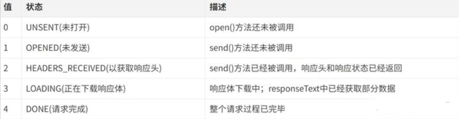

# AJAX(Async Javascript and XML)

即**异步**的**JavaScript** 和**XML**（可扩展标记语言，Extensible Markup Language）是一种用于存储和传输数据的标记语言。是一种创建交互式网页应用的网页开发技术，可以在不重新加载整个网页的情况下，与服务器交换数据，并且更新部分网页

Ajax 的**原理**简单来说通过 XmlHttpRequest 对象来向服务器发异步请求，从服务器（接收 HttpRequest）获得数据，然后用 JavaScript 来操作 DOM 而更新页面

# 实现过程

(1)创建 XMLHttpRequest 对象,也就是创建一个异步调用对象  
(2)创建一个新的 HTTP 请求,并指定该 HTTP 请求的方法、URL 及验证信息  
(3)设置响应 HTTP 请求状态变化的函数  
(4)发送 HTTP 请求  
(5)获取异步调用返回的数据  
(6)使用 JavaScript 和 DOM 实现局部刷新

1. 创建 XMLHttpRequest 对象
   通过 XMLHttpRequest() 构造函数用于初始化一个 XMLHttpRequest 实例对象

```javascript
const xhr = new XMLHttpRequest()
```

2. 与服务器建立连接
   通过 XMLHttpRequest 对象的 open() 方法与服务器建立连接

```javascript
xhr.open(method, url, [async][, user][, password])
```

参数说明：

1.  method：表示当前的请求方式，常见的有 GET、POST
2.  url：服务端地址
3.  async：布尔值，表示是否异步执行操作，默认为 true
4.  user: 可选的用户名用于认证用途；默认为`null
5.  password: 可选的密码用于认证用途，默认为`null

6.  给服务端发送数据
    通过 XMLHttpRequest 对象的 send() 方法，将客户端页面的数据发送给服务端

```javascript
xhr.send([body])
```

body: 在 XHR 请求中要发送的数据体，如果不传递数据则为 null

如果使用 GET 请求发送数据的时候，需要注意如下：

1.  将请求数据添加到 open()方法中的 url 地址中
2.  发送请求数据中的 send()方法中参数设置为 null

3.  绑定 onreadystatechange 事件
    onreadystatechange 事件用于监听服务器端的通信状态，主要监听的属性为 XMLHttpRequest.readyStatea

关于 XMLHttpRequest.readyState 属性有五个状态


只要 readyState 属性值一变化，就会触发一次 readystatechange 事件

5. XMLHttpRequest.responseText 属性接收服务器端的响应结果
6. 将处理结果更新到 HTML 页面中

# 封装一个简单的 ajax 请求

```javascript
//封装一个ajax请求
function ajax(options) {
    //创建XMLHttpRequest对象
    const xhr = new XMLHttpRequest()
    //初始化参数的内容
    options = options || {}
    options.type = (options.type || 'GET').toUpperCase()
    options.dataType = options.dataType || 'json'
    const params = options.data
    //发送请求
    if (options.type === 'GET') {
        xhr.open('GET', options.url + '?' + params, true)
        xhr.send(null)
    } else if (options.type === 'POST') {
        xhr.open('POST', options.url, true)
        xhr.send(params)
    //接收请求
    xhr.onreadystatechange = function () {
        if (xhr.readyState === 4) {
            let status = xhr.status
            if (status >= 200 && status < 300) {
                options.success && options.success(xhr.responseText, xhr.responseXML)
            } else {
                options.fail && options.fail(status)
            }
        }
    }
}
// 使用方式如下
ajax({
    type: 'post',
    dataType: 'json',
    data: {},
    url: 'https://xxxx',
    success: function(text,xml){//请求成功后的回调函数
        console.log(text)
    },
    fail: function(status){////请求失败后的回调函数
        console.log(status)
    }
})
```
