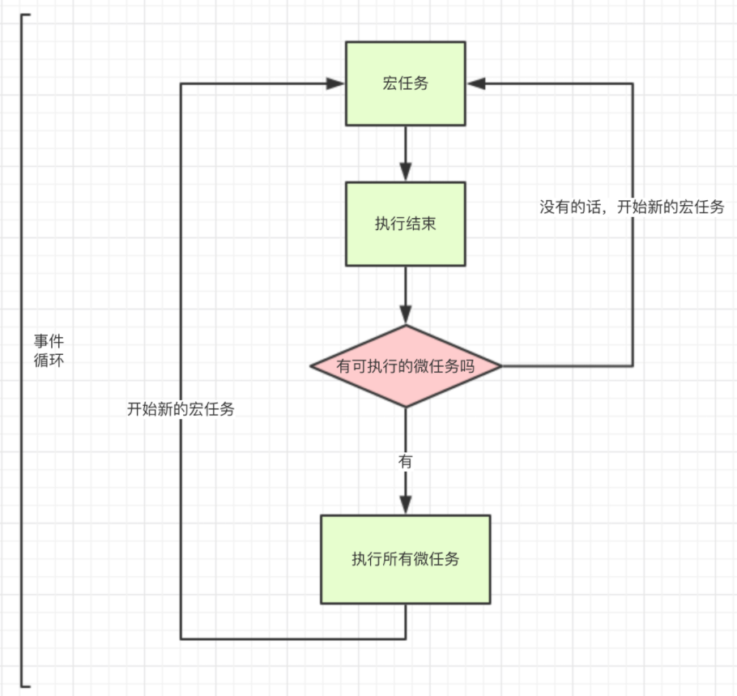

# 微任务
一个需要异步执行的函数，执行时机是在主函数执行结束之后、当前**宏任务结束之前**

常见的微任务有：
1. **Promise.then**
2. MutaionObserver
3. Object.observe（已废弃；Proxy 对象替代）
4. process.nextTick（Node.js）

# 宏任务
宏任务的时间粒度比较大，执行的时间间隔是不能精确控制的，对一些高实时性的需求就不太符合

常见的宏任务有：
1. script (可以理解为外层同步代码)
2. **setTimeout/setInterval**
3. UI rendering/UI事件
4. postMessage、MessageChannel
5. setImmediate、I/O（Node.js）
事件循环，宏任务，微任务的关系如图所示:

执行一个宏任务，如果遇到微任务就将它放到微任务的事件队列中
**先执行微任务在宏任务**
## 例子
```javascript
console.log(1)
setTimeout(()=>{
    console.log(2)
}, 0)
new Promise((resolve, reject)=>{
    console.log('new Promise')
    resolve()
}).then(()=>{
    console.log('then')
})
console.log(3)
```

1. 遇到 console.log(1) ，直接打印 1
2. 遇到定时器，属于新的宏任务，留着后面执行
3. 遇到 new Promise，这个是直接执行的，打印 'new Promise'
4. .then 属于微任务，放入微任务队列，后面再执行
5. 遇到 console.log(3) 直接打印 3
6. 好了本轮宏任务执行完毕，现在去微任务列表查看是否有微任务，发现 .then 的回调，执行它，打印 'then'
7. 当一次宏任务执行完，再去执行新的宏任务，这里就剩一个定时器的宏任务了，执行它，打印 2
