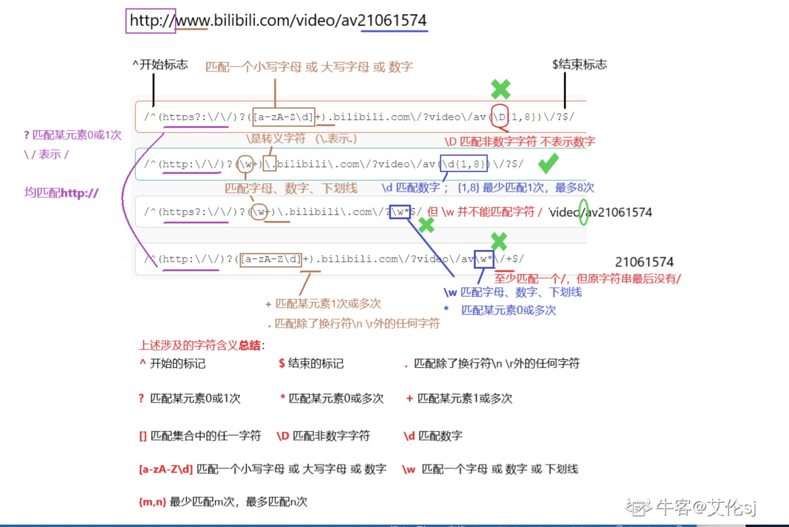

# 正则表达式 （Regular Expression，简称为 RegExp 或 regex）
它是一种用于描述字符串模式的表达式。

# 构建
在 JavaScript中，正则表达式也是对象，构建正则表达式有两种方式：
```javascript
1. 字面量创建，其由包含在斜杠之间的模式组成
const re = /\d+/g;
2. 调用RegExp对象的构造函数
const re = new RegExp("\\d+","g");
const rul = "\\d+"
const re1 = new RegExp(rul,"g");
使用构建函数创建，第一个参数可以是一个变量，遇到特殊字符\需要使用\\进行转义
```
# 规则

规则 | 描述 |
-|-|
.| 匹配除换行符以外的任意字符 |
^| 匹配输入字符串的开始 |
*| 匹配输入字符串的结尾 |
| |
| |
| |
| |
| |
| |
| |
| |
| |
| |
| |


