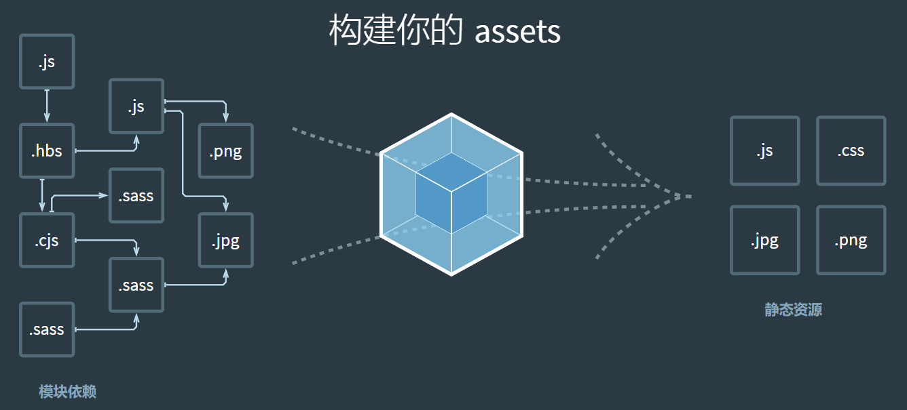
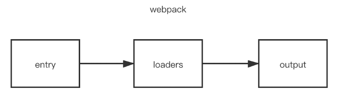

# Loader 用于对模块的"源代码"进行转换，在 import 或"加载"模块时预处理文件
webpack做的事情，仅仅是分析出各种模块的依赖关系，然后形成资源列表，最终打包生成到指定的文件中。

在webpack内部中，**任何文件都是模块**，不仅仅只是js文件  
默认情况下，在遇到import或者require加载模块的时候，webpack**只支持对js 和 json 文件打包**  
像**css、sass、png**等这些类型的文件的时候，webpack则无能为力，这时候就需要配置对应的**loader**进行文件内容的解析  
在加载模块的时候，执行顺序如下：

当 webpack 碰到不识别的模块的时候，webpack 会在配置的中查找该文件解析规则

关于配置loader的方式有三种：
1. 配置方式(常用)：在 webpack.config.js文件中指定 loader
2. 内联方式：在每个 import 语句中显式指定 loader
3. CLI 方式：在 shell 命令中指定它们

# 配置方式
关于loader的配置，是写在module.rules属性中，属性介绍如下代码：   
```javascript
module.exports = {
  module: {
    rules: [ //rules是一个数组的形式，因此我们可以配置很多个loader 
      {
        test: /\.css$/, //每一个loader对应一个对象的形式，对象属性test 为匹配的规则，一般情况为正则表达式  
        use: [ //属性use针对匹配到文件类型，调用对应的 loader 进行处理  
          { loader: 'style-loader' },
          {
            loader: 'css-loader',
            options: {
              modules: true
            }
          },
          { loader: 'sass-loader' }
        ]
      }
    ]
  }
};
// 从上述代码可以看到，在处理css模块的时候，use属性中配置了三个loader分别处理css文件，因为loader支持链式调用，链中的每个loader会处理之前已处理过的资源，最终变为js代码。顺序为相反的顺序执行，即上述执行方式为sass-loader、css-loader、style-loader
```

# 特性
1. loader 可以是同步的，也可以是异步的
2. loader 运行在 Node.js 中，并且能够执行任何操作
3. 除了常见的通过 package.json 的 main 来将一个 npm 模块导出为 loader，还可以在 module.rules 中使用 loader 字段直接引用一个模块
4. 插件(plugin)可以为 loader 带来更多特性
5. loader 能够产生额外的任意文件
通过 loader 的预处理函数，为 JavaScript 生态系统提供更多能力。用户可以更加灵活地引入细粒度逻辑（压缩、打包、语言翻译）

# 常见的loader
在页面开发过程中，我们经常性加载除了js文件以外的内容，这时候我们就需要配置响应的loader进行加载

常见的loader：

1. **style-loader**: 将css添加到DOM的内联样式标签style里
2. **css-loader** :允许将css文件通过require的方式引入，并返回css代码
3. **less-loader**: 处理less
4. **sass-loader**: 处理sass
5. postcss-loader: 用postcss来处理CSS
6. autoprefixer-loader: 处理CSS3属性前缀，已被弃用，建议直接使用postcss
7. **file-loader**: 分发文件到output目录并返回相对路径
```javascript
// 把识别出的资源模块，移动到指定的输出⽬目录，并且返回这个资源在输出目录的地址(字符串)
    npm install --save-dev file-loader
    rules: [
    ...,
    {
    test: /\.(png|jpe?g|gif)$/,
        use: {
        loader: "file-loader",
        options: {
            // placeholder 占位符 [name] 源资源模块的名称
            // [ext] 源资源模块的后缀
            name: "[name]_[hash].[ext]",
            //打包后的存放位置
            outputPath: "./images",
            // 打包后文件的 url
            publicPath: './images',
        }
        }
    }
    ]
```
8. **url-loader**: 和file-loader类似，但是当文件小于设定的limit时可以返回一个Data Url
```javascript
// 可以处理理 file-loader 所有的事情，但是遇到图片格式的模块，可以选择性的把图片转成 base64 格式的字符串，并打包到 js 中，对小体积的图片比较合适，大图片不合适。
    npm install --save-dev url-loader
    rules: [
    ...,
    {
    test: /\.(png|jpe?g|gif)$/,
        use: {
        loader: "url-loader",
        options: {
            // placeholder 占位符 [name] 源资源模块的名称
            // [ext] 源资源模块的后缀
            name: "[name]_[hash].[ext]",
            //打包后的存放位置
            outputPath: "./images"
            // 打包后文件的 url
            publicPath: './images',
            // 小于 100 字节转成 base64 格式
            limit: 100
        }
        }
    }
    ]
```
9. html-minify-loader: 压缩HTML
10. **babel-loader** :用babel来转换ES6文件到ES