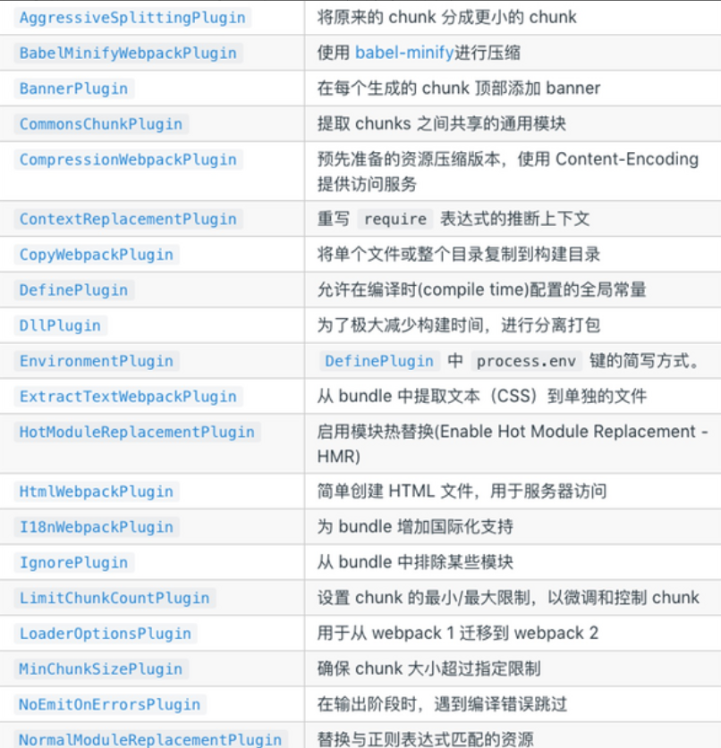

# Plugin
插件（Plugin）是用于执行各种构建任务和优化步骤的功能性模块  

插件通过在整个Webpack构建过程中的关键点注入自定义逻辑，以扩展或修改Webpack的默认行为。这些关键点通常包括打包前、打包中、打包后等不同阶段，以满足开发者对于构建流程的定制需求(代码分割、压缩、优化)

**目的**在于解决**loader**无法实现的其他事，使用插件可以大大提高Webpack的灵活性和功能性

# 特性
其**本质**是一个具有apply方法javascript对象
apply 方法会被 webpack compiler调用，并且在整个编译生命周期都可以访问 compiler对象

```javascript
const pluginName = 'ConsoleLogOnBuildWebpackPlugin'; //compiler hook 的 tap方法的第一个参数，驼峰式命名
class ConsoleLogOnBuildWebpackPlugin {
  apply(compiler) {
    compiler.hooks.run.tap(pluginName, (compilation) => {
      console.log('webpack 构建过程开始！');
    });
  }
}
module.exports = ConsoleLogOnBuildWebpackPlugin;
```
整个编译生命周期钩子：
entry-option ：初始化 option
run
compile： 真正开始的编译，在创建 compilation 对象之前
compilation ：生成好了 compilation 对象
make 从 entry 开始递归分析依赖，准备对每个模块进行 build
after-compile： 编译 build 过程结束
emit ：在将内存中 assets 内容写到磁盘文件夹之前
after-emit ：在将内存中 assets 内容写到磁盘文件夹之后
done： 完成所有的编译过程
failed： 编译失败的时候

# 常见Webpack插件：

# HtmlWebpackPlugin：在打包结束后，自动生成 HTML 文件，并将构建的脚本注入到 HTML 中
```javascript
npm install --save-dev html-webpack-plugin
// webpack.config.js
const HtmlWebpackPlugin = require("html-webpack-plugin");
module.exports = {
 ...
  plugins: [
     new HtmlWebpackPlugin({
       title: "My App",
       filename: "app.html",
       template: "./src/html/index.html"
     }) 
  ]
};
<!--./src/html/index.html-->
<!DOCTYPE html>
<html lang="en">
<head>
    <meta charset="UTF-8">
    <meta name="viewport" content="width=device-width, initial-scale=1.0">
    <meta http-equiv="X-UA-Compatible" content="ie=edge">
    <title><%=htmlWebpackPlugin.options.title%></title>
</head>
<body>
    <h1>html-webpack-plugin</h1>
</body>
</html>
```
在 html 模板中，可以通过 <%=htmlWebpackPlugin.options.XXX%> 的方式获取配置的值,更多的配置可以自寻查找

# clean-webpack-plugin 在构建之前清理输出目录，以确保每次构建都是从零开始的。
npm install --save-dev clean-webpack-plugin
const {CleanWebpackPlugin} = require('clean-webpack-plugin');
module.exports = {
 ...
  plugins: [
    ...,
    new CleanWebpackPlugin(),
    ...
  ]
}

# mini-css-extract-plugin 用于提取和打包 CSS 文件
```javascript
npm install --save-dev mini-css-extract-plugin
const MiniCssExtractPlugin = require('mini-css-extract-plugin');
module.exports = {
 ...,
  module: {
   rules: [
    {
     test: /\.s[ac]ss$/,
     use: [
      {
       loader: MiniCssExtractPlugin.loader
     },
          'css-loader',
          'sass-loader'
        ]
   }
   ]
 },
  plugins: [
    ...,
    new MiniCssExtractPlugin({
     filename: '[name].css'
    }),
    ...
  ]
}
```

# DefinePlugin 是一个webpack内置的插件，不需要安装，用于定义全局变量，这些变量在编译时可以被替换。

```javascript
const { DefinePlugun } = require('webpack')
module.exports = {
 ...
    plugins:[
        new DefinePlugin({
            BASE_URL:'"./"'
        })
    ]
}
```
这时候编译template模块的时候，就能通过下述形式获取全局对象
```javascript
<link rel="icon" href="<%= BASE_URL%>favicon.ico>"
```

# copy-webpack-plugin 用于拷贝文件或目录到构建目录dist
```javascript
npm install copy-webpack-plugin -D
new CopyWebpackPlugin({
    parrerns:[
        {
            from:"public",
            globOptions:{
                ignore:[
                    '**/index.html'
                ]
            }
        }
    ]
})
```
复制的规则在patterns属性中设置：

from：设置从哪一个源中开始复制

to：复制到的位置，可以省略，会默认复制到打包的目录下

globOptions：设置一些额外的选项，其中可以编写需要忽略的文件

#