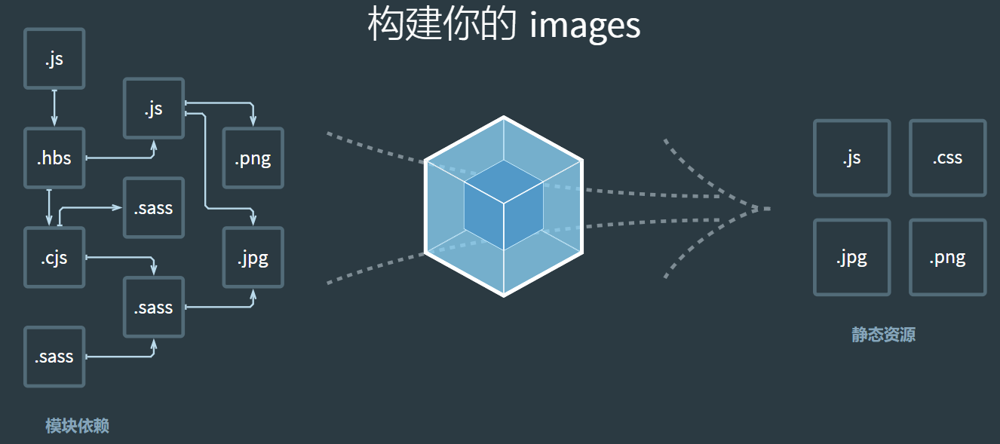

# Webpack 
一个用于现代JavaScript应用程序的**静态模块**打包工具
静态模块：开发阶段，可以被 webpack 直接引用的资源（可以直接被获取打包进bundle.js的资源）

1. 编译代码能力，提高效率，解决浏览器兼容问题  
2. 模块整合能力，提高性能，可维护性，解决浏览器频繁请求文件的问题  
3. 万物皆可模块能力，项目维护性增强，支持不同种类的前端模块类型，统一的模块化方案，所有资源文件的加载都可以通过代码控制 