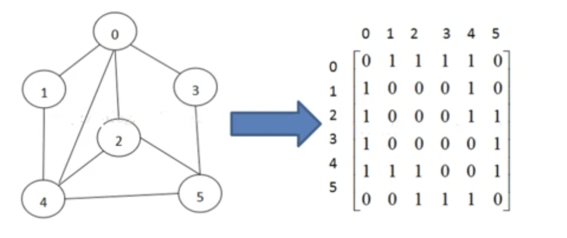
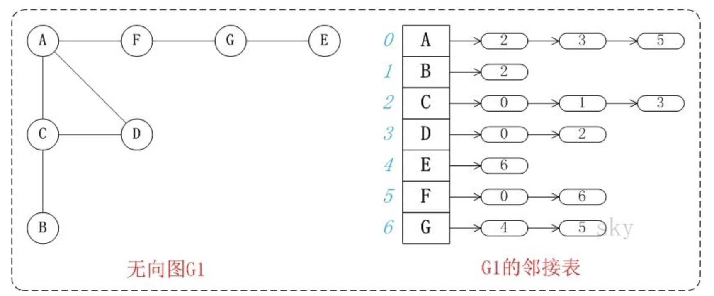
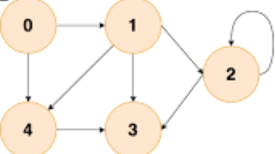

# 图
在计算机科学中，图是一种抽象的数据类型，在图中的数据元素通常称为结点，

**有向图**: 只能v->w，不能w->v 
**无向图**:  v,w没有顺序的

图的结构比较复杂，任意两个顶点之间都可能存在联系，因此无法以数据元素在存储区中的物理位置来表示元素之间的关系

## 常见表达图
### 邻接矩阵

通过使用一个二维数组G[N][N]进行表示N个点到N-1编号，通过邻接矩阵可以立刻看出两顶点之间是否存在一条边，只需要检查邻接矩阵行i和列j是否是非零值，对于无向图，邻接矩阵是对称的

### 邻接表



在javascript中，可以使用Object进行表示，如下：

const graph = {
  A: [2, 3, 5],
  B: [2],
  C: [0, 1, 3],
  D: [0, 2],
  E: [6],
  F: [0, 6],
  G: [4, 5]
}
图的数据结构还可能包含和每条边相关联的数值（edge value），例如一个标号或一个数值（即权重，weight；表示花费、容量、长度等）
# 图常见的操作
构建一个图的邻接矩阵表示



```js
const graph = {
  0: [1, 4],
  1: [2, 4],
  2: [2, 3],
  3: [],
  4: [3],
}
```
### 深度优先遍历
尽可能的往深处的搜索图的分支
实现思路  
首先应该确定一个根节点  
然后对根节点的没访问过的相邻节点进行深度优先遍历  
确定以 0 为根节点，然后进行深度遍历，然后遍历1，接着遍历 2，然后3，此时完成一条分支0 - 1- 2- 3的遍历，换一条分支，也就是4，4后面因为3已经遍历过了，所以就不访问了

```js
const visited = new Set()
const dfs = (n) => {
  console.log(n)
  visited.add(n) // 访问过添加记录
  graph[n].forEach(c => {
    if(!visited.has(c)){ // 判断是否访问呢过
      dfs(c)
    }
  })
}
```
### 广度优先遍历
先访问离根节点最近的节点，然后进行入队操作  
思路：  
新建一个队列，把根节点入队  
把队头出队并访问  
把队头的没访问过的相邻节点入队  
重复二、三步骤，知道队列为空  

```js
const visited = new Set()
const dfs = (n) => {
  visited.add(n)
  const q = [n]
  while(q.length){
    const n = q.shift()
    console.log(n)
    graph[n].forEach(c => {
      if(!visited.has(c)){
        q.push(c)  
        visited.add(c)
      }
    })
  }
}
``

