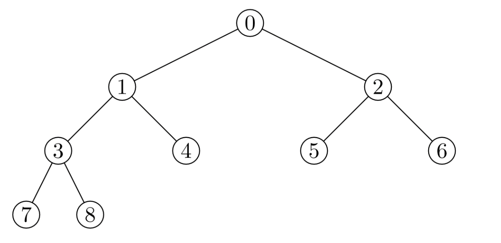

# 堆(Heap)
计算机科学中一类特殊的数据结构的统称  

堆通常是一个可以被看做一棵完全二叉树的数组对象


# 性质
1. 堆中**某个结点**的**值**总是**不大于**或**不小于**其**父结点**的值(不等于)
2. 堆总是一棵**完全二叉树**
### 堆又可以分成：
1. 最大堆：每个根结点，都有根结点的值大于两个孩子结点的值
2. 最小堆：每个根结点，都有根结点的值小于孩子结点的值

# 操作
堆的元素存储方式，按照完全二叉树的顺序存储方式存储在一个一维数组中

用一维数组存储: [0, 1, 2, 3, 4, 5, 6, 7, 8]
根据完全二叉树的特性，可以得到如下特性：
1. 数组零坐标代码的是堆顶元素
2. 一个节点的父亲节点的坐标等于其坐标除以2整数部分
3. 一个节点的左节点等于其本身节点坐标 * 2 + 1
4. 一个节点的右节点等于其本身节点坐标 * 2 + 2

构建最小堆的构造函数和对应的属性方法
```js
class MinHeap {
  constructor() {
    // 存储堆元素
    this.heap = []
  }
  // 获取父元素坐标
  getParentIndex(i) {
    return (i - 1) >> 1  //右移一位等价于将数值除以2并向下取整  2^1  2^2 2^3    
  }

  // 获取左节点元素坐标
  getLeftIndex(i) {
    return i * 2 + 1
  }

 // 获取右节点元素坐标
  getRightIndex(i) {
    return i * 2 + 2
  }

  // 交换元素
  swap(i1, i2) {
    const temp = this.heap[i1]
    this.heap[i1] = this.heap[i2]
    this.heap[i2] = temp
  }

  // 查看堆顶元素
  peek() {
    return this.heap[0]
  }

  // 获取堆元素的大小
  size() {
    return this.heap.length
  }
}
```
### 插入
将值插入堆的底部，即数组的尾部，当插入一个新的元素之后，堆的结构就会被破坏，因此需要堆中一个元素做上移操作  

将这个值和它父节点进行交换，直到父节点小于等于这个插入的值，大小为k的堆中插入元素的时间复杂度为O(logk)  
```JS
// 插入元素
insert(value) {
  this.heap.push(value)
  this.shifUp(this.heap.length - 1)
}

// 上移操作
shiftUp(index) {
  if (index === 0) { return }
  const parentIndex = this.getParentIndex(index)
  if(this.heap[parentIndex] > this.heap[index]){
    this.swap(parentIndex, index)
    this.shiftUp(parentIndex)
  }
}
```
###  删除
用数组**尾部元素**替换堆顶，这里不直接删除堆顶，因为所有的元素会向前移动一位，会破坏了堆的结构

然后进行下移操作，将新的堆顶和它的子节点进行交换，直到子节点大于等于这个新的堆顶，删除堆顶的时间复杂度为O(logk)
```JS
// 删除元素
pop() {
  this.heap[0] = this.heap.pop()
  this.shiftDown(0)
}

// 下移操作
shiftDown(index) {
  const leftIndex = this.getLeftIndex(index)
  const rightIndex = this.getRightIndex(index)
  if (this.heap[leftIndex] < this.heap[index]){
    this.swap(leftIndex, index)
    this.shiftDown(leftIndex)
  }
  if (this.heap[rightIndex] < this.heap[index]){
    this.swap(rightIndex, index)
    this.shiftDown(rightIndex)
  }
}
```

# 堆的时间复杂度
堆的插入和删除时间复杂度都是**Olog(n)**，原因在于包含n个节点的完全二叉树，树的高度不会超过log2n

堆化的过程是顺着节点所在路径比较交换的，所以堆化的时间复杂度跟树的高度成正比，也就是Olog(n)
插入数据和删除堆顶元素的主要逻辑就是堆化


## 根据堆的特性，我们可以使用堆来进行排序操作，也可以使用其来求第几大或者第几小的值