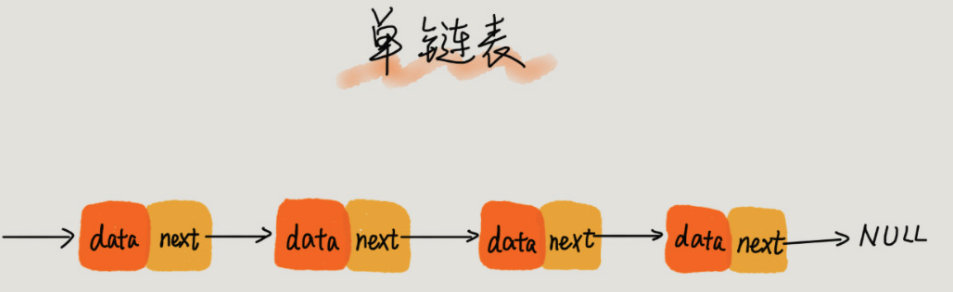
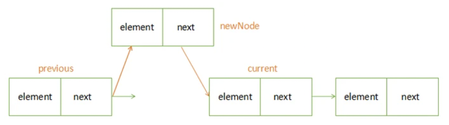
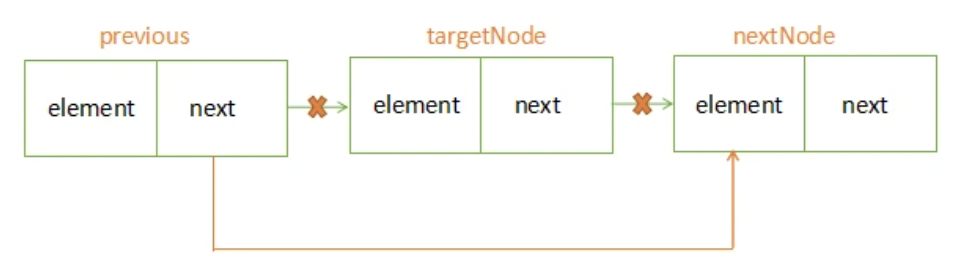

# 链表（Linked List）
一种物理存储单元上非连续、非顺序的存储结构，数据元素的逻辑顺序是通过链表中的指针链接次序实现的，由一系列结点（链表中每一个元素称为结点）组成  

每个**结点**包括两个部分：一个是存储数据元素的数据域，另一个是存储下一个结点地址的指针域

节点用代码表示
```js
class Node {
  constructor(val) {
    this.val = val;
    this.next = null;
  }
}
```
data 表示节点存放的数据
next 表示下一个节点指向的内存空间
相比于线性表顺序结构，操作复杂。
由于不必须按顺序存储，链表在插入的时候可以达到**O(1)**的复杂度，比另一种线性表顺序表快得多
查找一个节点或者访问特定编号的节点则需要O(n)的时间，而线性表和顺序表相应的时间复杂度分别是**O(logn)**和**O(1)**

# 常见的链表
1. 单链表：除了头节点和尾节点，其他节点只包含一个后继指针
2. 循环链表：跟单链表唯一的区别就在于它的尾结点又指回了链表的头结点，首尾相连，形成了一个环
3. 双向链表：每个结点具有两个方向指针，后继指针(next)指向后面的结点，前驱指针(prev)指向前面的结点，其中节点的前驱指针和尾结点的后继指针均指向空地址NULL
4. 双向循环链表：跟双向链表基本一致，不过头节点前驱指针指向尾迹诶单和尾节点的后继指针指向头节点
# 操作

## 遍历 next指针遍历下去，直到为null
```js
let current = head
while(current){
 console.log(current.val)
  current = current.next
}
```

## 插入 向链表中间插入一个元素

插入节点步骤：  
1. 存储插入位置的前一个节点
2. 存储插入位置的后一个节点
3. 将插入位置的前一个节点的 next 指向插入节点
4. 将插入节点的 next 指向前面存储的 next 节点

```js
let current = head
while (current < position){
  pervious = current;
  current = current.next;
}
pervious.next = node;
node.next = current;
```
如果在头节点进行插入操作的时候，会实现previousNode节点为undefined  
可以是在头节点前面添加一个虚拟头节点，保证插入行为一致  

## del删除 向链表任意位置删除节点

删除节点步骤：
1. 获取删除节点的前一个节点
2. 获取删除节点的后一个节点
3. 将前一个节点的 next 指向后一个节点
4. 向删除节点的 next 指向为null
```js
while (current != node){
  pervious = current;
  current = current.next;
  nextNode = current.next;
}
pervious.next = nextNode
```

# 应用
缓存
一种提高数据读取性能的技术，在硬件设计、软件开发中都有着非常广泛的应用，比如常见的CPU缓存、数据库缓存、浏览器缓存等等

当缓存空间被用满时，我们可能会使用LRU（Least Recently Used）一种缓存淘汰算法，它的基本思想是保留最近使用过的数据，淘汰最久未被使用的数据

实现LRU算法的数据结构是哈希表和双向链表：
1. 使用一个哈希表（HashMap）来存储缓存的键值对，键为缓存的关键字，值为对应的数据。
2. 使用一个双向链表（Linked List）来维护缓存中的数据顺序，链表头部表示最近使用过的数据，尾部表示最久未被使用的数据。
3. 当有新的数据被访问时，如果数据已经存在于缓存中，则将其移动到链表头部，表示最近使用过。如果数据不存在于缓存中，需要插入到缓存，并且检查缓存是否达到容量上限，如果达到则淘汰链表尾部的数据。
4. 当缓存中的数据被访问时，将其移动到链表头部，表示最近使用过。
```js
class LRUCache {
  constructor(capacity) {
    this.capacity = capacity;
    this.cache = new Map();
    this.order = [];
  }

  get(key) {
    if (this.cache.has(key)) {
      // 将数据移到数组头部表示最近使用过
      this.updateOrder(key);
      return this.cache.get(key);
    } else {
      return -1;
    }
  }

  put(key, value) {
    if (this.cache.has(key)) {
      // 如果数据已存在，更新值并移到数组头部
      this.updateOrder(key);
    } else {
      // 如果缓存已满，淘汰最久未使用的数据
      if (this.order.length >= this.capacity) {
        const removedKey = this.order.shift();
        this.cache.delete(removedKey);
      }
      // 插入新数据到数组头部
      this.order.unshift(key);
    }
    this.cache.set(key, value);
  }

  updateOrder(key) {
    // 将数据移到数组头部表示最近使用过
    const index = this.order.indexOf(key);
    if (index !== -1) {
      this.order.splice(index, 1);
      this.order.unshift(key);
    }
  }
}

// 示例
const lruCache = new LRUCache(3);
lruCache.put("a", 1);
lruCache.put("b", 2);
lruCache.put("c", 3);

console.log(lruCache.get("a")); // 输出: 1
console.log(lruCache.get("b")); // 输出: 2

lruCache.put("d", 4);

console.log(lruCache.get("c")); // 输出: -1（已被淘汰）
```
